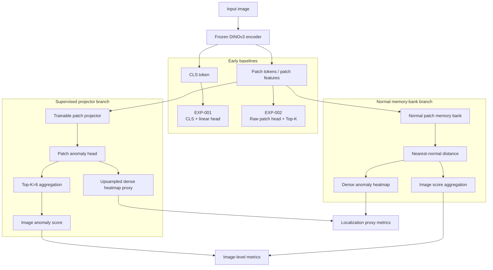
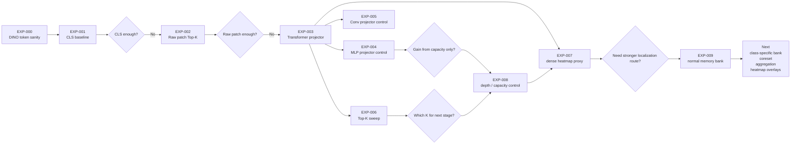
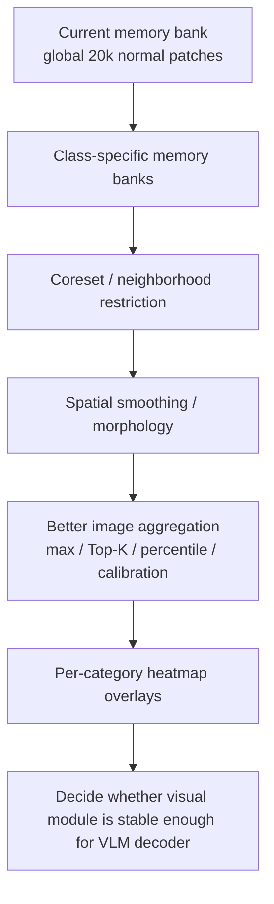

# 實驗脈絡與架構總覽

這頁的目的不是列更多分數，而是回答三個報告時一定會被問到的問題：

1. 確立 DINOv3 encoder 之後，我們到底設計了什麼 downstream 架構？
2. EXP-001 到 EXP-009 彼此是什麼承先啟後關係？
3. 分數沒有全面超過 `97`，這些實驗各自還有什麼研究價值？

## 一句話版本

目前已經形成兩條 visual anomaly module 路線：

| 路線 | 目前定位 | 主要回答 |
| --- | --- | --- |
| Supervised projector branch | VisA image-level supervised baseline | DINO patch tokens 後面應該接什麼 trainable module？ |
| Normal memory-bank branch | MVTec / localization baseline | 不訓練 anomaly head，只用 normal patch memory 能不能產生 anomaly map？ |

目前最穩的 supervised 架構是：

```text
Image -> Frozen DINOv3 -> Patch Tokens -> 6-layer Transformer Projector
      -> Patch Anomaly Head -> Top-K=6 Aggregation -> Image Anomaly Score
```

目前最有潛力的 localization branch 是：

```text
Image -> Frozen DINOv3 -> Patch Features -> Normal Patch Memory Bank
      -> Nearest-Normal Distance -> Dense Anomaly Heatmap
```

這兩條都還不是 final paper architecture，但已經不是只在做 encoder selection。

## 目前架構圖



## 分數與角色總表

| ID | 它回答的問題 | 主要結果 | 對目前進度的貢獻 |
| --- | --- | --- | --- |
| EXP-000 | DINOv3 能不能正確載入並吐出 CLS / patch tokens？ | patch tokens shape 正確 | 建立實驗平台，不是 performance claim |
| EXP-001 | 如果只用 CLS token + linear head，DINOv3 是否可用？ | AUROC `90.99`，AUPRC `69.17` | 證明 frozen DINOv3 有基本可用性，但 CLS summary 不夠 |
| EXP-002 | 改用 patch tokens + Top-K 是否自然變好？ | AUPRC `70.22`，只小幅提升 | 證明 raw patch evidence 不夠，需要中間 module |
| EXP-003 | patch tokens 後加 Transformer projector 是否有效？ | AUPRC `87.41`，F1max `80.78` | 第一個有價值的 supervised downstream 架構候選 |
| EXP-004 | Transformer 的提升是否只是因為多了非線性 projector？ | MLP AUPRC `84.78`，接近但低於 EXP-003 | 證明 nonlinear projector 很重要，但 Transformer 仍較平衡 |
| EXP-005 | local Conv projector 是否是更好的 spatial module？ | patch-grid 幾乎失效 | 負面結果，排除 naive Conv projector 主線 |
| EXP-006 | Top-K 取多少比較合理？ | `K=6` 優於 `K=1/12` | 讓後續實驗固定 Top-K=6，有初步依據 |
| EXP-007 | image 分數高的 supervised projector 是否也有 localization 訊號？ | 6-layer Transformer dense F1max `24.12` | 把問題從 image-level 推向 heatmap，不再只看分類分數 |
| EXP-008 | Transformer 的收益是否只是參數量 / depth？ | depth9 MLP 低於 depth2 MLP；depth2 Transformer image AUROC 高但 dense 弱 | 證明不能只靠加深 MLP，token interaction 有必要但深度仍要平衡 |
| EXP-009 | normal-only memory bank 能否支援 MVTec / localization？ | VisA dense F1max `35.19`；MVTec dense F1max `39.49` | 開出第二條 localization / MVTec branch |

## 承先啟後關係



## 為什麼沒有超過 97 仍然有意義

第一，這一輪不是 final SOTA chasing，而是在拆解問題。若一開始只追最高分，會不知道分數來自 encoder、projector、aggregation、資料 protocol，還是 threshold calibration。

第二，低分實驗有排除價值：

| 低分或不夠高的結果 | 它排除了什麼錯誤方向 |
| --- | --- |
| EXP-001 CLS baseline 不高 | 不能只拿 DINO CLS token 接 linear head 當完整方法 |
| EXP-002 raw patch Top-K 只小幅提升 | patch token 本身不是答案，中間需要 anomaly-specific module |
| EXP-005 Conv projector localization 失效 | naive local Conv 不適合作為目前主線 |
| EXP-008 depth9 MLP 沒有提升 | 不是把 MLP 加深、參數變多就會更好 |
| EXP-009 VisA image-level 弱 | global normal memory bank 需要 class-specific bank 與 score calibration |

第三，目前最接近 `97` 的數字是 EXP-008b 的 image AUROC `96.97`，但它的 dense F1max 較弱。因此不能只拿最高 AUROC 決定架構。對工業瑕疵而言，能不能定位缺陷也很重要。

## 目前可以對外說的 claim

可以說：

> We fixed DINOv3 as the visual encoder and shifted the work to downstream anomaly module design. The current best supervised branch is a patch-token Transformer projector with Top-K patch scoring, while the normal memory-bank branch is a promising localization and MVTec-compatible direction.

中文報告可以說：

> 我們已經不再比較 encoder，而是固定 DINOv3，往後設計 visual anomaly module。目前有兩個具體候選：一個是 supervised patch Transformer projector，負責 VisA image-level anomaly scoring；另一個是 normal patch memory bank，負責 localization 與 MVTec normal-only protocol。這兩條都還沒達到博班簡報的 `99` 分，但已經能清楚指出下一步要改哪裡。

不要說：

- 已經達到博士班簡報 P13-P14 的 `99` 分結果。
- 已經完成 final architecture。
- Memory-bank 已經可以取代 supervised projector。
- Dense heatmap proxy 等同原始解析度 full pixel metric。

## 下一步設計方向

目前最合理的下一步不是接 VLM，而是把 memory-bank / localization branch 做成更完整的 anomaly module：



可用公式描述目前 supervised branch：

$$
p_i = \mathrm{DINOv3}_{patch}(x)_i
$$

$$
z_i = h_{\theta}(g_{\theta}(p_i))
$$

$$
S_{image} = \frac{1}{K}\sum_{i \in \mathrm{TopK}(z)} z_i,\quad K=6
$$

其中 $g_{\theta}$ 是 patch projector，$h_{\theta}$ 是 patch anomaly head。EXP-003/004/008 都是在測 $g_{\theta}$ 應該長什麼樣子。

Memory-bank branch 則是：

$$
d_i = \min_{m_j \in \mathcal{M}_{normal}} \left\| \hat{p_i} - \hat{m_j} \right\|_2
$$

其中 $\mathcal{M}_{normal}$ 是 normal patch memory bank，$d_i$ 可形成 anomaly heatmap。EXP-009 證明這條路在 localization 上有訊號，但 image score aggregation 還需要設計。
