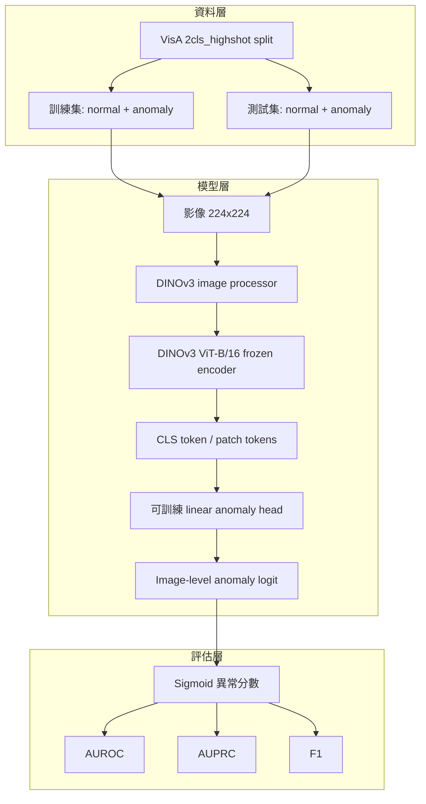
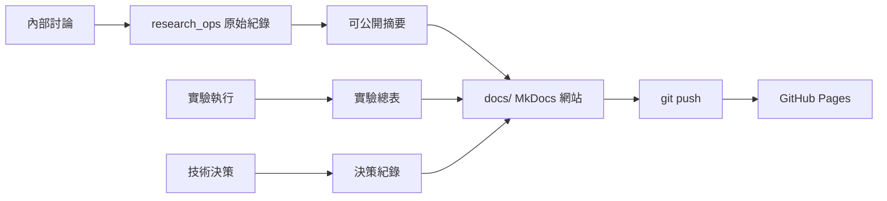

# 研究系統圖

本頁整理可公開的研究圖。後續可轉成 paper figure、簡報圖或國科會成果報告圖。

## 目前 Baseline

## 文件與實驗更新流程

## 圖表待辦

| 圖表 | 用途 | 狀態 |
| --- | --- | --- |
| Baseline pipeline | 說明 DINOv3 frozen encoder supervised AD | 已用 Mermaid 起草 |
| Experiment lifecycle | 說明內部筆記到 GitHub Pages 的更新流程 | 已用 Mermaid 起草 |
| Future VLM architecture | 比較 DINO 路線與 Anomaly-OV style route | 規劃中 |
| Paper-ready pipeline | 轉成 paper 可用向量圖 | 規劃中 |
