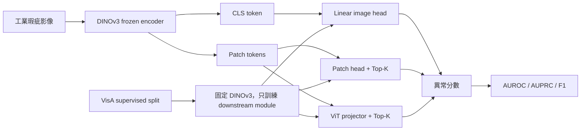

# DINO 工業瑕疵研究進度

本網站用來追蹤 DINOv3-based industrial defect understanding 研究的公開進度。
目標是用可持續更新的網頁取代每週手做簡報：研究方向、實驗結果、技術決策與下一步會隨 Markdown 更新，push 後自動部署到 GitHub Pages。

!!! warning "公開摘要原則"
    這裡只放可公開摘要。實驗室內部討論原文、未公開資料、具名意見、未確認結果與敏感路徑不放在 `docs/`。

## 目前研究方向

短期先建立乾淨、可回溯的 supervised anomaly detection baseline。Encoder 已固定為 DINOv3，後續主軸改成 anomaly-specific component：

完整 VLM、LLM reasoning、Anomaly-OV reimplementation、多資料集大規模訓練，都排在 baseline 穩定之後。

## 最新狀態

| 面向 | 目前狀態 | 下一個產出 |
| --- | --- | --- |
| 文件網站 | MkDocs strict build 已通過，支援 Mermaid 圖與 LaTeX 公式 | GitHub Pages 自動部署 |
| 實驗環境 | DINO HPC scaffold 與 repo 專屬 venv 已可用 | 固定可重跑的 GPU 實驗流程 |
| Component ablation | `EXP-003` 已完成：ViT projector + Top-K 明顯優於 CLS baseline | pixel-level heatmap / localization |
| 協作紀錄 | 內部討論與公開摘要分離 | 持續更新公開安全摘要 |

## 重點頁面

- [12 週規劃](roadmap/12-week-plan.md)
- [每週進度](weekly/README.md)
- [實驗總表](experiments/registry.md)
- [EXP-001 Image-Level 表格](experiments/exp-001-image-level-table.md)
- [EXP-002/003 Patch Component Ablation](experiments/exp-002-003-patch-component-ablation.md)
- [技術決策紀錄](decisions/decision-log.md)
- [研究系統圖](figures/research-system.md)
- [評估指標定義](figures/metrics.md)
- [HPC + uv 工作流程](operations/hpc-uv-workflow.md)
- [公開討論摘要](public-discussions/README.md)

## 更新規則

每次有新進度時，先判斷內容層級：

| 內容類型 | 放置位置 |
| --- | --- |
| 原始討論、草稿、未公開細節 | `research_ops/` |
| 可公開研究摘要 | `docs/public-discussions/` |
| 技術決策 | `docs/decisions/decision-log.md` |
| 實驗設定與結果 | `docs/experiments/registry.md` |
| 每週進度 | `docs/weekly/` |
