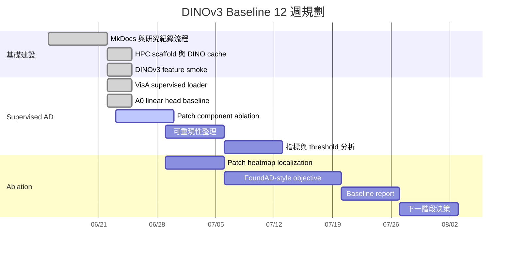

# 12 週研究規劃

規劃期間：2026-06-15 至 2026-09-06。

核心目標：固定 DINOv3 frozen encoder，建立 supervised anomaly detection baseline，逐步把 image-level scoring 推進到 patch-level heatmap / localization，並把實驗與決策過程整理成可回溯、可協作、可公開展示的紀錄。

## 週別規劃

| 週次 | 日期 | 重點 | 預計產出 |
| --- | --- | --- | --- |
| W1 / 2026-W25 | 2026-06-15 至 2026-06-21 | 建立研究紀錄網站與 DINO baseline 工作流骨架 | MkDocs Pages scaffold、公開/內部文件分流、第一個 GPU baseline |
| W2 / 2026-W26 | 2026-06-22 至 2026-06-28 | 完成 DINOv3 CLS baseline 與 patch component ablation | EXP-001/002/003 overall 與 per-category metrics、component decision |
| W3 / 2026-W27 | 2026-06-29 至 2026-07-05 | 從 EXP-003b 產生 patch-score heatmaps | VisA pixel-level AUROC / AUPRC / F1max、heatmap examples |
| W4 / 2026-W28 | 2026-07-06 至 2026-07-12 | 比較 supervised ViT projector 與 FoundAD-style objective | image-level + pixel-level component comparison |
| W5 / 2026-W29 | 2026-07-13 至 2026-07-19 | 補 threshold / failure case 分析 | per-category failure cases、threshold policy、PR/ROC curves |
| W6 / 2026-W30 | 2026-07-20 至 2026-07-26 | 整理第一版 component baseline report | GitPage 公開摘要與可轉進國科會進度報告的表格 |
| W7 / 2026-W31 | 2026-07-27 至 2026-08-02 | 根據 pixel-level 結果決定下一個 component | Top-K / projector depth / loss ablation 計畫 |
| W8 / 2026-W32 | 2026-08-03 至 2026-08-09 | 深入 projector / aggregation ablation | depth、heads、K 值比較 |
| W9 / 2026-W33 | 2026-08-10 至 2026-08-16 | 擴充至更多資料切分或資料集 | VisA split sensitivity 或 MVTec pilot |
| W10 / 2026-W34 | 2026-08-17 至 2026-08-23 | 建立 paper/report figures | pipeline figure、heatmap figure、metric tables |
| W11 / 2026-W35 | 2026-08-24 至 2026-08-30 | Baseline report draft | 可公開摘要、圖表、已知限制 |
| W12 / 2026-W36 | 2026-08-31 至 2026-09-06 | 下一階段決策 | 選擇是否進入 VLM reasoning / Anomaly-OV-style integration |

## 短期成功標準

- DINOv3 model 可以從 project cache 穩定載入。
- Feature extraction 能回傳 CLS 與 patch tokens，且 shape 有紀錄。
- VisA supervised split 可以穩定重現載入。
- 至少兩種 image-level downstream components 在相同 protocol 下完成比較。
- 目前最佳 image-level component 可以輸出 patch-level evidence，支援下一階段 heatmap。
- 每個實驗都在實驗總表記錄 result path 與結論。

## 暫緩項目

以下工作等 baseline 可信後再進行：

- LLM reasoning 與 report generation。
- 完整 Anomaly-OV reimplementation。
- 使用 MVTec、BTAD、MANTA、WebAD、IMDD-1M 或 Real-IAD 的 multi-dataset training。
- 將 pixel-level localization 作為第一階段主要目標。
