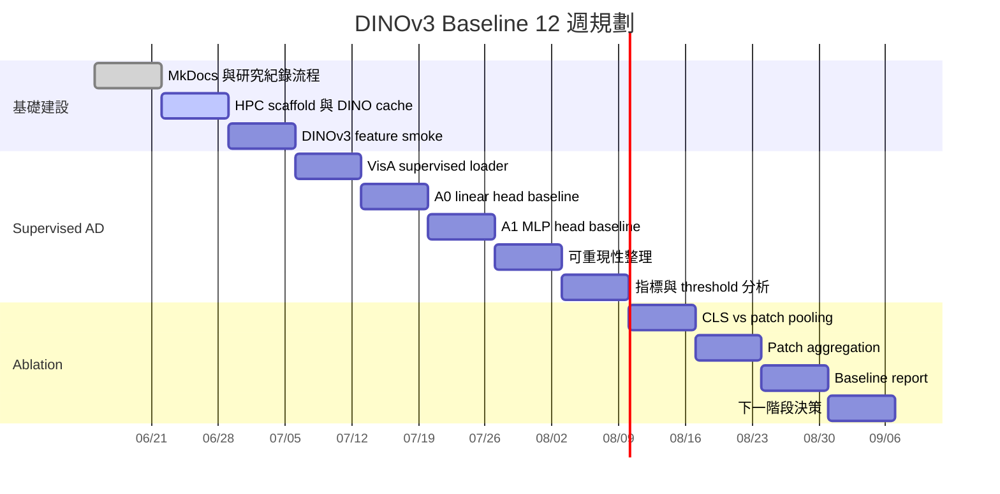

# 12 週研究規劃

規劃期間：2026-06-15 至 2026-09-06。

核心目標：建立 DINOv3 frozen encoder 的 supervised image-level anomaly detection baseline，並把實驗與決策過程整理成可回溯、可協作、可公開展示的紀錄。

## 週別規劃

| 週次 | 日期 | 重點 | 預計產出 |
| --- | --- | --- | --- |
| W1 / 2026-W25 | 2026-06-15 至 2026-06-21 | 建立研究紀錄網站與 DINO baseline 工作流骨架 | MkDocs Pages scaffold、公開/內部文件分流、第一個 GPU baseline |
| W2 / 2026-W26 | 2026-06-22 至 2026-06-28 | 清理 HPC scaffold，確認 DINOv3 模型下載與快取位置 | `download_hf.sh` 可穩定支援 DINOv3、可重現環境紀錄 |
| W3 / 2026-W27 | 2026-06-29 至 2026-07-05 | DINOv3 feature extraction smoke test | CLS token 與 patch token shape 紀錄 |
| W4 / 2026-W28 | 2026-07-06 至 2026-07-12 | 建立 VisA image-level dataset loader | `2cls_highshot.csv` supervised split 檢查、label mapping、dataset sanity report |
| W5 / 2026-W29 | 2026-07-13 至 2026-07-19 | Baseline A0：frozen DINOv3 + linear head | 第一版 AUROC / AUPRC / F1 表格 |
| W6 / 2026-W30 | 2026-07-20 至 2026-07-26 | Baseline A1：frozen DINOv3 + MLP head | A0 vs A1 比較與 failure cases |
| W7 / 2026-W31 | 2026-07-27 至 2026-08-02 | 可重現性整理 | seeds、config snapshots、log/checkpoint naming convention |
| W8 / 2026-W32 | 2026-08-03 至 2026-08-09 | 指標與 threshold 分析 | threshold policy、F1 selection rule、PR/ROC curves |
| W9 / 2026-W33 | 2026-08-10 至 2026-08-16 | CLS vs pooled patch tokens | pooling ablation table |
| W10 / 2026-W34 | 2026-08-17 至 2026-08-23 | Patch-token aggregation exploration | max/average/top-k image score comparison |
| W11 / 2026-W35 | 2026-08-24 至 2026-08-30 | Baseline report draft | 可公開摘要、圖表、已知限制 |
| W12 / 2026-W36 | 2026-08-31 至 2026-09-06 | 下一階段決策 | 選擇下一個 ablation：SigLIP/BLIP encoder、attention pooling 或 patch localization |

## 短期成功標準

- DINOv3 model 可以從 project cache 穩定載入。
- Feature extraction 能回傳 CLS 與 patch tokens，且 shape 有紀錄。
- VisA supervised split 可以穩定重現載入。
- 至少兩種 image-level heads 在相同 protocol 下完成比較。
- 每個實驗都在實驗總表記錄 result path 與結論。

## 暫緩項目

以下工作等 baseline 可信後再進行：

- LLM reasoning 與 report generation。
- 完整 Anomaly-OV reimplementation。
- 使用 MVTec、BTAD、MANTA、WebAD、IMDD-1M 或 Real-IAD 的 multi-dataset training。
- 將 pixel-level localization 作為第一階段主要目標。
